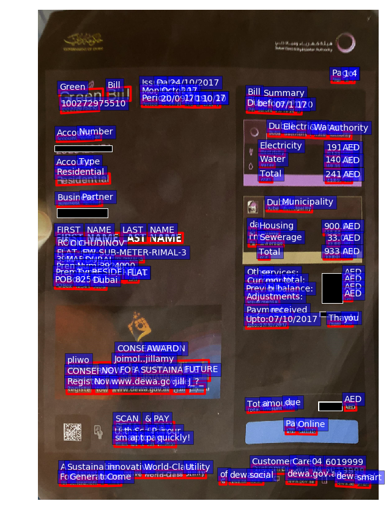
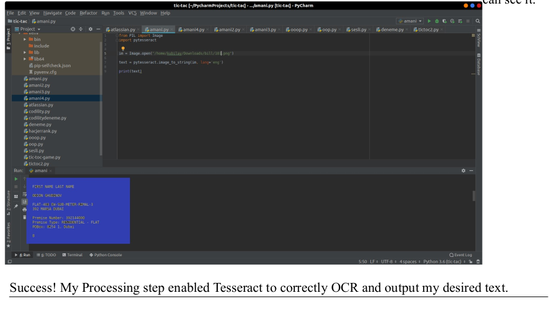

# ocr
optical character recognition

## Detecting Location and OCR

  

## Prerequisites
To perform object detection(location detection) using openCV I did these steps:
1. InstallPyhton on my ubuntu 18.04(I already installed before this project)
2. Install Anaconda environments and its dependencies
3. Download pytesseract
4. Run the my codes

## Setup
I installed the following dependencies via Anaconda:
• Numpy
• SciPy
• OpenCV
• Pillow
• Matplotlib
• Keras
I have installed the dependencies, I wrote my location detection code. Create a Python file and give
it name denn.py

## Explanation of denn.py code:

• I import the necessary packages
• Initialize the list of reference points and boolean indicating whether cropping is being
performed or not
• I use left mouse button in order to click and record the starting (x,y) coordinates and indicate
that cropping being performed.
• Draw a rectangle around the region of interest
• Load the image and setup the mouse callback function
• Display the image and wait for a keypress
• If the ‘c’ key is pressed, break from the loop(Now after selecting a proper selection like
below(green rectangle) , just press ‘c’ to extract, as programmed. It will appear like below)
• Close all open windows

## OCR Process 

  

## Pytesseract:

It will recognize and read the text present in images. It can read all image types — png, jpeg, gif, tiff,
bmp etc. It’s widely used to process everything from scanned documents. I made negative effects on
query.JPEG and I found location then I have implemented OCR processing.

## TODO
- [x] Detecting Location
- [x] OCR
- [ ] Microsoft Azure Method

